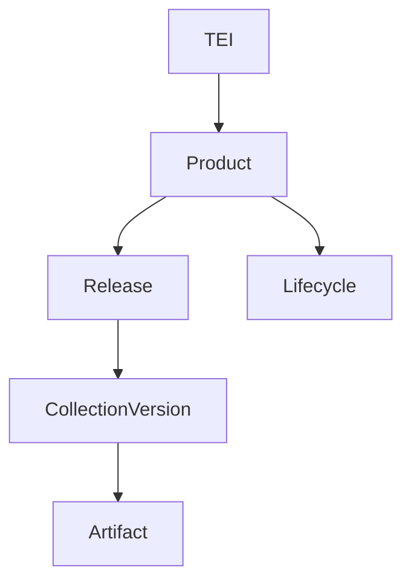

# 📘 TEA API Overview
**Version:** 1.5  
**Status:** Draft (Core TEA Specification)

---

## Table of Contents

- [1. Introduction](#1-introduction)
- [2. Purpose and Scope](#2-purpose-and-scope)
- [3. Relationship to TEI and Discovery](#3-relationship-to-tei-and-discovery)
- [4. API Design Principles](#4-api-design-principles)
- [5. Core Resource Model](#5-core-resource-model)
- [6. Collections](#6-collections)
- [7. Collection Versioning and Update Semantics](#7-collection-versioning-and-update-semantics)
- [8. Artifacts](#8-artifacts)
- [9. Lifecycle Information (CLE)](#9-lifecycle-information-cle)
- [10. Retrieval Patterns](#10-retrieval-patterns)
- [11. Compliance Documents (Publisher Scope)](#11-compliance-documents-publisher-scope)
- [12. Representation Formats](#12-representation-formats)
- [13. Versioning and Evolution](#13-versioning-and-evolution)
- [14. Error Handling Overview](#14-error-handling-overview)
- [15. Relationship to Trust Architecture](#15-relationship-to-trust-architecture)
- [16. Security Considerations](#16-security-considerations)
- [17. References](#17-references)

---

## 1. Introduction

The TEA API provides a standardized interface for retrieving:

- release definitions  
- software artifacts  
- lifecycle information  

It is the operational layer of TEA, translating identifiers and discovery results into actionable data.

---

## 2. Purpose and Scope

This document describes the **conceptual API model**, including:

- resource structure  
- relationships between objects  
- retrieval patterns  

It does NOT:

- define exact endpoints (see OpenAPI specification)  
- define trust validation (see TEA trust architecture)  

---

## 3. Relationship to TEI and Discovery

The TEA API is not accessed directly.

The process is:

```text
TEI → discovery → API base URL → API request
```

Steps:

1. Extract authority from TEI  
2. Retrieve discovery document  
3. Obtain API base URL  
4. Perform API requests  

---

### Key Principle

```text
TEI identifies what → discovery identifies where → API retrieves data
```

---

## 4. API Design Principles

### 4.1 Resource-Oriented

- collections and artifacts are first-class entities  

---

### 4.2 Deterministic Retrieval

```text
Given a TEI, repeated requests MUST return equivalent results.
```

---

### 4.3 Separation of Concerns

- API → data retrieval  
- trust architecture → validation  

---

### 4.4 Immutability of Artifacts

```text
Artifacts MUST be immutable once published.
```

---

## 5. Core Resource Model



---

### Key Distinction

- **Product** = entity identified by TEI  
- **Release** = version of a product  
- **Collection Version** = revision of release metadata  

---

## 6. Collections

A **TEA collection** represents the authoritative definition of a product release.

It contains:

- release metadata  
- artifact references  
- integrity information (e.g., digests)  

---

### Important Property

Collections evolve over time.

They allow:

- corrections  
- updates to vulnerability information  
- improved metadata  

without redefining the release itself.

---

## 7. Collection Versioning and Update Semantics

### 7.1 Rationale

Collections are versioned to provide:

- traceability  
- auditability  
- comparison over time  

---

### 7.2 Normative Principle

```text
A release MAY have multiple collection versions.
Each collection version represents a revision of the same release.
```

---

### 7.3 Allowed Changes Between Versions

- updated VEX or vulnerability information  
- metadata corrections  
- additional descriptive context  

---

### 7.4 Forbidden Changes

```text
Artifact digests for existing entries MUST NOT change.
The identity of the release MUST NOT change.
```

---

### 7.5 Update Reason

Each collection version SHOULD include a machine-readable reason.

Example values:

```text
- updated-vex-information
- metadata-correction
- spelling-fix
- additional-context
- other
```

---

### 7.6 Retrieval of Versions

Conceptual API patterns:

```text
GET /collections?tei=<tei>                → latest version
GET /collections/{id}                    → specific version
GET /collections/{id}/versions           → version history
```

---

### 7.7 Comparison and Audit

Versioning enables:

- diffing collection changes  
- tracking vulnerability evolution  
- audit trails for compliance  

---

## 8. Artifacts

Artifacts are the actual deliverables associated with a release.

Examples:

- SBOM (CycloneDX, SPDX)  
- binaries  
- VEX documents  
- attestations  

---

### Key Properties

```text
Artifacts are immutable and may be reused across multiple collections.
```

---

## 9. Lifecycle Information (CLE)

Lifecycle information provides standardized status for products and releases.

TEA adopts the:

```text
ECMA-428 — Common Lifecycle Enumeration (CLE)
```

as the authoritative lifecycle vocabulary.

---

### 9.1 Normative Requirement

```text
Lifecycle values in TEA MUST be expressed using the Common Lifecycle Enumeration (CLE) syntax and vocabulary as defined in ECMA-428.
```

---

### 9.2 Forward Compatibility and Dependency Decoupling

```text
TEA implementations MUST support CLE as defined in ECMA-428.

Future revisions of ECMA-428 MAY be adopted without requiring changes to this specification, provided that:

- new lifecycle values remain semantically compatible, and
- consumers follow CLE-defined interpretation rules.
```

---

### 9.3 Examples

```text
- supported
- end-of-support
- end-of-security-updates
- end-of-life
- superseded
```

---

### 9.4 Consumer Requirement

```text
Consumers MUST interpret lifecycle values according to CLE semantics.
```

---

### 9.5 Important Distinction

Lifecycle:

- does NOT affect cryptographic validity  
- is critical for operational and compliance decisions  

---

## 10. Retrieval Patterns

### 10.1 Collection Retrieval

```text
GET /collections?tei=<tei>
```

---

### 10.2 Artifact Retrieval

Artifacts MAY be retrieved independently of collections.

---

### 10.3 Artifact Delivery Modes

#### 1. Artifact Only

```text
Content-Type: application/octet-stream
```

---

#### 2. Artifact + Detached Signature

```text
Content-Type: multipart/*
```

Contains:

- artifact  
- signature  

---

#### 3. Artifact + Evidence Bundle

```text
Content-Type: multipart/*
```

Contains:

- artifact  
- evidence bundle  

---

### Design Insight

These modes support:

- simple download use cases  
- advanced verification workflows  

---

## 11. Compliance Documents (Publisher Scope)

TEA APIs MAY expose **compliance documents** associated with the publisher (authority).

---

### Scope

```text
Compliance documents are scoped to the authority (domain owner).
They are not associated with specific products, releases, or collections.
```

---

### Access Model

Conceptual API patterns:

```text
GET /compliance-documents
GET /compliance-documents/{type}
```

---

### Identifier Model

Compliance documents are represented in the OpenAPI model using:

```text
idType = COMPLIANCE_DOCUMENT
```

---

### Design Note

```text
Compliance documents are part of the publisher context, not the product context.
```

---

## 12. Representation Formats

### JSON

Used for:

- collections  
- lifecycle data  

---

### Binary

Used for:

- artifacts  

---

### Multipart

Used for:

- combined delivery  

---

## 13. Versioning and Evolution

```text
Implementations SHOULD maintain backward compatibility.
Unknown fields MUST be ignored.
```

---

## 14. Error Handling Overview

### 400 — Invalid Request

- malformed TEI  
- invalid parameters  

---

### 404 — Not Found

- resource does not exist  

---

### 500 — Server Error

- internal failure  

---

### Client Behavior

```text
Clients SHOULD retry transient errors and fail closed when critical data is missing.
```

---

## 15. Relationship to Trust Architecture

This document defines data retrieval only.

The TEA trust architecture defines:

- signature validation  
- timestamp validation  
- transparency verification  
- trust anchors  

---

### Separation Principle

| Layer | Responsibility |
|------|--------------|
| API | data retrieval |
| Trust Architecture | validation |

---

## 16. Security Considerations

The API alone does not establish trust.

Consumers MUST validate:

- integrity  
- authenticity  
- provenance  

---

### Risks

- malicious API endpoints  
- stale collection versions  
- tampered responses  

---

## 17. References

- RFC 3986 — URI Syntax  
- RFC 9110 — HTTP Semantics  
- ECMA-428 — Common Lifecycle Enumeration (CLE), Ecma International  

---
