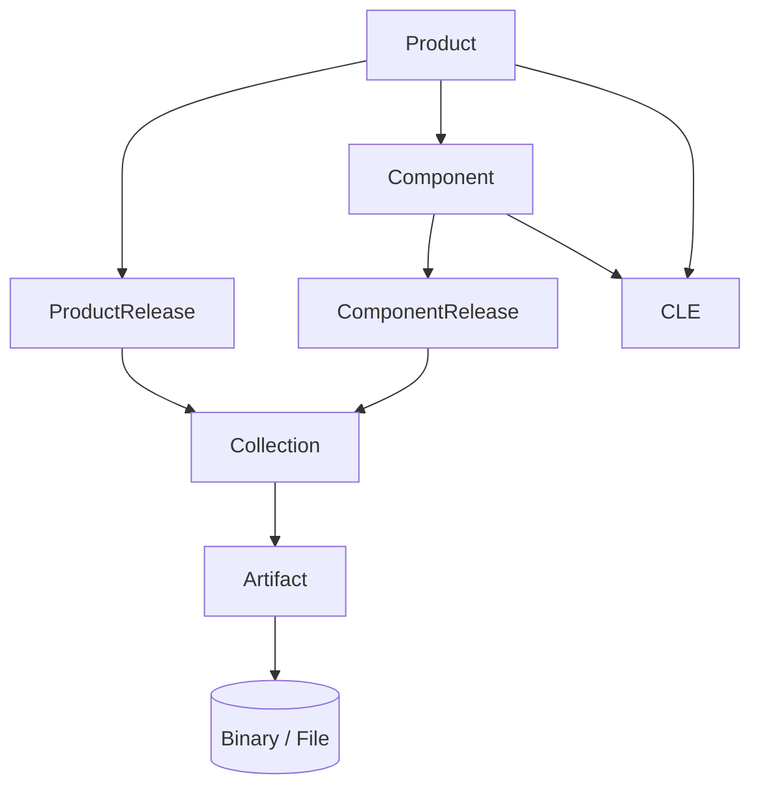

# 📘 TEA Core Data Model (Educational Overview)
**Version:** 1.0  
**Status:** Informational (Non-Normative)

---

## Table of Contents

- [1. Introduction](#1-introduction)
- [2. Design Goals](#2-design-goals)
- [3. Core Concepts](#3-core-concepts)
- [4. Object Model Overview](#4-object-model-overview)
- [5. Detailed Object Descriptions](#5-detailed-object-descriptions)
  - [5.1 Product](#51-product)
  - [5.2 Component](#52-component)
  - [5.3 Releases](#53-releases)
  - [5.4 Collection](#54-collection)
  - [5.5 Artifact](#55-artifact)
  - [5.6 Identifiers](#56-identifiers)
  - [5.7 Lifecycle Information (CLE)](#57-lifecycle-information-cle)
- [6. Relationships and Constraints](#6-relationships-and-constraints)
- [7. Versioning and State Model](#7-versioning-and-state-model)
- [8. Data Flow in Practice](#8-data-flow-in-practice)
- [9. Key Design Principles](#9-key-design-principles)
- [10. Summary](#10-summary)

---

## 1. Introduction

The Transparency Exchange API (TEA) defines a structured data model for publishing and consuming software supply chain information.

At its core, TEA models:

- products and components  
- their releases  
- the artifacts associated with those releases  
- the relationships between them  

This document explains the **core TEA data model only**, without introducing the TEA trust architecture (e.g., signatures, timestamps, transparency logs, or DNS-based trust anchoring).

---

## 2. Design Goals

The TEA data model is designed to:

- provide a **clear and deterministic structure** for software releases  
- enable **traceability** between products, components, and artifacts  
- support **reuse of artifacts across multiple releases**  
- separate **release definition** from **artifact storage**  
- allow **lifecycle management independent of releases**  

A key design decision is the **strict separation of concerns**:

| Concern | Covered by |
|--------|-----------|
| Structure and relationships | TEA data model |
| Trust and verification | TEA trust architecture (separate) |
| Lifecycle meaning | CLE |

---

## 3. Core Concepts

The TEA data model revolves around a small number of core concepts:

- **Product** — a deliverable system or solution  
- **Component** — a reusable building block  
- **Release** — a versioned state of a product or component  
- **Collection** — the authoritative definition of a release  
- **Artifact** — a concrete file or object (SBOM, binary, etc.)  
- **Identifiers** — globally unique identifiers (TEI, CPE, PURL)  
- **CLE** — lifecycle semantics across versions  

---

## 4. Object Model Overview

The following diagram illustrates the relationships between TEA objects:



---

## 5. Detailed Object Descriptions

### 5.1 Product

A **Product** represents a complete deliverable system.

Examples:

- an IoT device firmware  
- an enterprise software product  
- a SaaS offering  

A product:

- has a unique identity  
- may consist of multiple components  
- has multiple releases over time  

---

### 5.2 Component

A **Component** is a reusable unit that may be used across products.

Examples:

- a software library  
- a service  
- a module  

A component:

- can exist independently of a product  
- may be reused in multiple products  
- has its own release lifecycle  

---

### 5.3 Releases

TEA distinguishes between two types of releases:

#### ProductRelease

Represents a version of a product.

Examples:

- version 1.0 of a device firmware  
- release 2026.04 of a platform  

---

#### ComponentRelease

Represents a version of a component.

Examples:

- library version 2.3.1  
- API version v5  

---

### Key rule

A release is always:

- immutable once published  
- versioned  
- associated with exactly one collection  

---

### 5.4 Collection

A **Collection** is the central object in TEA.

It defines:

> “This is the complete and authoritative set of artifacts for this release.”

A collection:

- belongs to exactly one release  
- contains references to artifacts  
- includes metadata such as checksums and descriptions  
- is versioned  

Important:

- a collection describes **composition**, not storage  
- it does not contain the artifact data itself  
- it does NOT carry lifecycle state (this is handled by CLE)  

---

### 5.5 Artifact

An **Artifact** is a concrete object associated with a release.

Examples:

- SBOM (CycloneDX, SPDX)  
- binary files  
- configuration files  
- documentation  
- attestations  

Artifacts:

- are immutable once published  
- can be reused across multiple collections  
- are referenced by collections via checksums  

---

### Artifact delivery

Artifacts may be retrieved in different ways:

- raw binary  
- binary + detached signature  
- binary + associated metadata  

The TEA data model does not constrain transport format.

---

### 5.6 Identifiers

TEA supports multiple identifier systems:

- **TEI (Transparency Exchange Identifier)** — primary TEA identifier  
- **CPE (Common Platform Enumeration)**  
- **PURL (Package URL)**  

Identifiers:

- provide global uniqueness  
- enable interoperability  
- allow cross-system referencing  

---

### 5.7 Lifecycle Information (CLE)

**Common Lifecycle Enumeration (CLE)** describes lifecycle states across versions.

Examples:

- supported  
- deprecated  
- end-of-life  
- superseded  

Important properties:

- CLE applies to **products or components**, not releases  
- CLE spans **multiple versions**  
- CLE is **independent of collections and artifacts**  

---

### CLE as versioned documents

CLE information is expressed as **versioned lifecycle documents**.

- each update to lifecycle information results in a **new CLE version**  
- previous versions MUST remain accessible  
- lifecycle changes (e.g., updated end-of-life date) MUST NOT overwrite history  

---

### CLE and releases

CLE documents:

- describe lifecycle **across releases**, not within a single release  
- may reference multiple releases implicitly or explicitly  
- provide temporal context that collections do not express  

---

## 6. Relationships and Constraints

### 6.1 Collection ownership

A collection MUST belong to exactly one:

- ProductRelease  
  OR  
- ComponentRelease  

It MUST NOT belong to both.

---

### 6.2 Artifact reuse

Artifacts MAY be referenced by multiple collections.

This enables:

- reuse across releases  
- reuse across products and components  

---

### 6.3 Separation of concerns

- Collection → defines composition  
- Artifact → represents data  
- CLE → defines lifecycle meaning  

These concerns MUST NOT be mixed.

---

## 7. Versioning and State Model

### 7.1 Releases

Releases are:

- versioned  
- immutable after publication  

---

### 7.2 Collections

Collections may evolve before publication:

```
draft → ready → published
```

Once published:

- they are immutable  
- new versions must be created for changes  

---

### 7.3 Artifacts

Artifacts are:

- immutable  
- content-addressed (via checksum)  

---

### 7.4 Lifecycle (CLE)

Lifecycle documents are:

- versioned  
- append-only (new versions replace old, but do not overwrite)  

Systems MUST:

- retain historical versions  
- allow comparison between versions  

---

## 8. Data Flow in Practice

A typical flow:

1. Create product and component definitions  
2. Define releases  
3. Upload artifacts  
4. Create a collection referencing artifacts  
5. Publish the collection  
6. Publish or update lifecycle (CLE) documents  

After publication:

- the collection becomes the authoritative release definition  
- artifacts become part of a release context  
- lifecycle evolves independently via CLE  

---

## 9. Key Design Principles

### 9.1 Immutability

Once published:

- releases  
- collections  
- artifacts  

MUST NOT change.

Lifecycle (CLE):

- MUST NOT overwrite previous versions  

---

### 9.2 Reusability

Artifacts are reusable across:

- collections  
- releases  
- products  

---

### 9.3 Clear ownership

Each collection has:

- one release context  
- one authoritative meaning  

---

### 9.4 Separation from trust

The TEA data model:

- does NOT define signatures  
- does NOT define timestamps  
- does NOT define trust anchors  

Those belong to the **TEA trust architecture overlay**.

---

## 10. Summary

The TEA core data model defines a structured way to describe software releases:

- Products and components define **what exists**  
- Releases define **versions over time**  
- Collections define **what belongs to a release**  
- Artifacts define **the actual data**  
- CLE defines **lifecycle meaning across versions**  

This separation enables:

- clarity  
- interoperability  
- scalability  

and provides a clean foundation for the TEA trust architecture to build upon.
