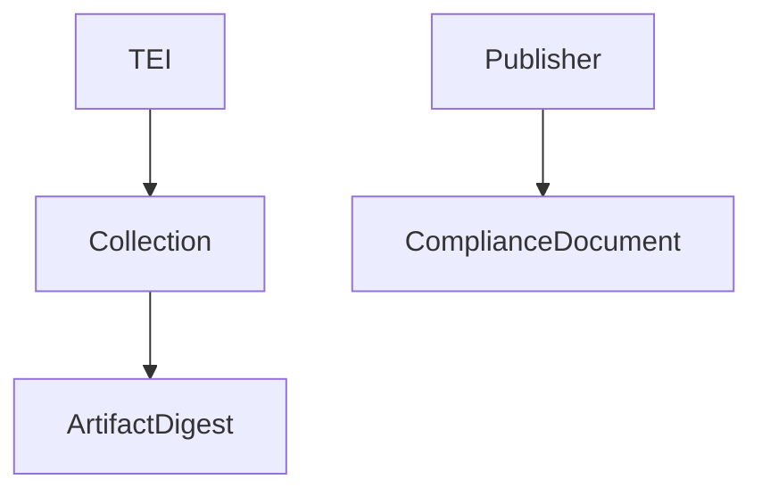

# 📘 TEA Identity and Referencing Model
**Version:** 1.0  
**Status:** Draft (Core TEA Specification)

---

## Table of Contents

- [1. Introduction](#1-introduction)
- [2. Purpose and Scope](#2-purpose-and-scope)
- [3. Identity Domains in TEA](#3-identity-domains-in-tea)
- [4. TEI – Product Identity](#4-tei--product-identity)
- [5. Artifact Identity (Digest-Based)](#5-artifact-identity-digest-based)
- [6. Compliance Document Identity](#6-compliance-document-identity)
- [7. Referential Integrity Model](#7-referential-integrity-model)
- [8. Identity Stability and Immutability](#8-identity-stability-and-immutability)
- [9. Cross-Collection Reuse](#9-cross-collection-reuse)
- [10. Implementation Considerations](#10-implementation-considerations)
- [11. Interoperability Requirements](#11-interoperability-requirements)
- [12. Security Considerations](#12-security-considerations)
- [13. References](#13-references)

---

## 1. Introduction

TEA relies on multiple identity mechanisms, each serving a distinct purpose.

These identities operate in different domains:

- product identity  
- content identity  
- publisher identity  

This document defines how these identities are structured and how they relate to each other.

---

## 2. Purpose and Scope

This specification defines:

- identity types used in TEA  
- how objects are referenced  
- how identity enables reuse and validation  

It does NOT define:

- trust validation  
- cryptographic verification  

---

## 3. Identity Domains in TEA

TEA separates identity into three domains:

| Domain | Identity Mechanism | Scope |
|------|------------------|------|
| Product | TEI | Product / release |
| Artifact | Digest (SHA-256) | Content |
| Publisher | Compliance ID | Organization |

---

### Design Principle

```text
Each identity domain MUST be independent and non-overlapping.
```

---

## 4. TEI – Product Identity

The **Transparency Exchange Identifier (TEI)** identifies a product.

---

### Properties

- globally unique within a domain  
- human-meaningful or externally derived  
- stable over time  

---

### Normative Constraint

```text
TEI MUST NOT be used to identify artifacts.
```

---

### Rationale

TEI represents:

```text
"what the product is"
```

not:

```text
"what content was produced"
```

---

## 5. Artifact Identity (Digest-Based)

Artifacts are identified using a SHA-256 digest.

---

### Normative Requirement

```text
Artifact identity MUST be defined as:

digest = SHA-256(binary representation)
```

---

### Properties

- content-addressable  
- immutable  
- globally unique  

---

### Rationale

```text
Artifact identity represents "what the content is".
```

---

### Important Constraint

```text
Any change to the artifact results in a new identity.
```

---

## 6. Compliance Document Identity

Compliance documents use predefined identifiers.

---

### Normative Requirement

```text
Compliance document identifiers MUST use the enumerated types defined in the TEA OpenAPI specification.
```

---

### Properties

- scoped to publisher  
- not globally unique content identifiers  
- semantic identifiers, not cryptographic  

---

### Rationale

```text
Compliance identity represents "what assurance is claimed".
```

---

## 7. Referential Integrity Model

TEA establishes relationships between objects using identity references.

---

### Model



---

### Binding Rules

```text
Collections MUST reference artifacts by digest.
Collections MUST NOT embed artifact identity in any other form.
```

---

### Key Principle

```text
References MUST always use the native identity of the target domain.
```

---

## 8. Identity Stability and Immutability

### Artifact Identity

```text
Immutable by definition.
```

---

### TEI

```text
Stable across product lifecycle.
```

---

### Compliance Identity

```text
Stable but may evolve in availability or scope.
```

---

### Design Insight

```text
Stability enables long-term validation and reproducibility.
```

---

## 9. Cross-Collection Reuse

Artifacts are designed for reuse.

---

### Normative Rule

```text
The same artifact digest MAY appear in multiple collections.
```

---

### Implications

- no duplication of content  
- consistent validation results  
- shared evidence applicability  

---

### Important Distinction

```text
Collections are versioned.
Artifacts are not.
```

---

## 10. Implementation Considerations

### Storage Model

```text
Store artifacts keyed by digest.
Store collections separately.
Link via references.
```

---

### Caching

```text
Artifact caching is safe due to immutability.
```

---

### Indexing

```text
Indexes SHOULD be built on:
- TEI
- artifact digest
- collection identifiers
```

---

## 11. Interoperability Requirements

### Producers

```text
MUST:
- use TEI for product identity
- use SHA-256 for artifact identity
- use defined compliance identifiers
```

---

### Consumers

```text
MUST:
- resolve identities correctly
- verify artifact digests
- respect identity domain separation
```

---

### Prohibited Behavior

```text
Implementations MUST NOT:
- use TEI to identify artifacts
- use filenames as identity
- substitute digest-based identity
```

---

## 12. Security Considerations

### Risks

- identity confusion  
- incorrect binding between objects  
- reuse of incorrect artifacts  

---

### Mitigations

- strict identity separation  
- digest verification  
- explicit reference validation  

---

### Critical Principle

```text
Incorrect identity handling invalidates the entire trust model.
```

---

## 13. References

- RFC 3986 — URI Syntax  
- FIPS 180-4 — Secure Hash Standard (SHA-256)  
- RFC 4648 — Base64URL Encoding  

---